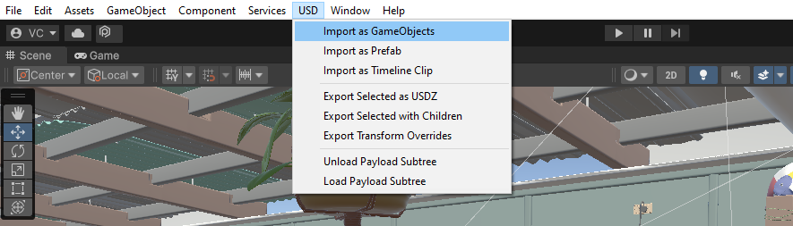

# Importing USD Files

To import a USD file into Unity, use the USD context menu, and select one of the 'Import as ...' options as required. Supported USD file formats are:

-   .usd
-   .usda
-   .usdc
-   .usdz

## Importing Options

-   **Import As GameObjects**: Imports selected USD file as GameObjects directly into the Scene Hierarchy for the open scene.

-   **Import as Prefab**: Imports selected USD file as a Prefab into the project folder. This method will also generate PlayableAssets and materials that can be reused. Note that the import will be much slower than for GameObjects, and the prefab must be unpacked to make any changes.

-   **Import as Timeline Clip**: Imports selected USD file as a Prefab containing empty Materials and the Timeline Clip. If animation is recorded in the Timeline Clip, that can be used to animate other applicable Unity Objects.

## Importing Materials

Materials are not loaded by default. To import materials from USD, firstly import the USD file using the USD menu. Then, to get the materials, change the 'Import Settings' > 'Materials' in the Inspector to 'Import Preview Surface'. Finally re-import the USD file.

## Importing Payloads

Payloads are not loaded by default. If you are using payloads, in order to see anything in the scene,  firstly import the USD file using the USD menu. Then, to get the payloads, change the 'Import Settings' > 'Payload Policy' in the Inspector to 'Load All''. Finally re-import the USD file, which might take a while.

## Primitive Sanitization on Import

In order to fit Unity formats, during import we perform the following sanitization steps as required:

### Cameras and Xforms

Convert basis:
-   Converting from authored orientation to Unity's left handed orientation. The advanced import settings allow different methods of converting basis:
    -   Fast With Negative Scale: 
    -   SlowAndSafe (default)
    -   SlowAndSafeAsFBX
    -   None

### Meshes

Convert basis:
- As above, meshes also go through a basis conversion as required.

Triangulate meshes:
- Converting from USD-supported arbitrary polygon meshes to triangular meshes.

Change vertex winding order: 
- Unity uses a clockwise mesh winding order, where other DCCs may use counterclockwise.

Unroll primvars: 
- Unity meshes require same length arrays for all channels, so we convert all primvars to the interpolation that requires the longest arrays, which is *face varying*. Our mesh therefore has a vertex array containing one value per vertex per face, with no verts shared.
