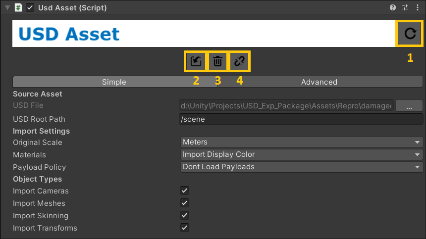

# USD in the Editor
## USD Components
The USD package provides various script components to interact with the imported USD files.
### USD Asset
The root of a GameObject hierarchy generated from the import of a USD file will have the following component:

The *UsdAsset* component contains settings for the USD file import, as well as functionality for refreshing, reimporting, deleting and unlinking the USD asset.

**1. Refresh values from USD**

Reimport the USD scene by updating the objects in-place.

**2. Reimport from USD (destructive)**

Reimport the USD scene by fully destroying and rebuilding every object. Note that changes applied inside Unity, such as adding components or child GameObjects, will also be destroyed. The transform and any other serializable values on the root object will also be reset.

**3. Remove USD Contents (destructive)**

Find and destroys all GameObjects that were imported from USD.

**4. Detach, remove all USD components**

Finds and destroys all USD behaviors and destroys them, ignoring the generated GameObjects and other components.

**Import settings**

*Original scale*

The scale that the object was originally authored with.

*Materials*

Which material policy to import with;
* **Import Display Color (default)** - import the display color from the prim and apply this as a single color on the USD/StandardVertexColor shader.
* **Import Preview Surface** - Import the USDPreviewSurface shader and map the textures and values to the default shader for the project’s render pipeline.
* **None** - do not import any materials.

*Payload Policy*
Overall payload import policy;
* **Don’t Load Payloads (default)** - Import without any payloads.
* **Load All** - Import and load all payloads.
 
 Payloads can also be individually loaded and unloaded on the specific prims using the Inspector Window for the GameObject.

**Advanced**

Under the Advanced tab you can see more settings, to tweak how the USD file is imported and converted to Unity. 

### USD Prim Source

A component to mark an individual prim in the hierarchy, containing the meta data for that prim. Ticking ‘Show USD Inspector’ will show in depth detail about the prim composition.

### USD Assembly Root

A component to mark the root of a model with Kind set as “Assembly”. An assembly is a model made of more models, for example a film set or a game level. It is often useful to have special processing behavior for assemblies, so this is actually less of a behavior and more of a marker or attribute on the GameObject.

### USD Layer Stack

A component for managing USD layers in a multi-layer shot context.

### USD Model Root

A component to mark the root of a model with Kind set as “Model”.

### USD Payload

A component to control the individual payload state for a payloaded prim. You can use this to load and unload individual payloads.

### USD Variant Set

A component to represent one or more USD variant sets. This object holds the selection state and exposes access to the current selection.

## Variants, Models, & Payloads
Access to variant selection, model details, and payload state are all accessible via the inspector on the game object at which these features were authored.

Note that Payloads *are not loaded by default*. USD files using Payloads must be reloaded after changing the Payload Policy in the Inspector to 'Load All' for them to appear in the Scene. Alternatively, payloads can be loaded by either ticking 'IsLoaded' in the UsdPayload component of an individual payload, or using 'Load Payload Subtree' in the USD menu to load all payloads in the selected GameObject and its children.

When importing a USD file containing variants as a prefab, any instantiated GameObject of that prefab must be unpacked before the selected variant can be changed.

## Streaming Playback via Timeline
After importing a USD file with either skeletal or point cache animation...
1. Open the Timeline window.
2. Select the root of the USD file.
3. Create a playable director by clicking the "Create" button in the Timeline window.
4. Next, drag the root USD file into the Timeline to create a track for this object.
5. Finally, drag the USD file once more to add a USD clip to the track for playback.

Scrubbing through time will now update the USD scene by streaming data from USD. Timeline playback is multi-threaded using the C# Job System.

