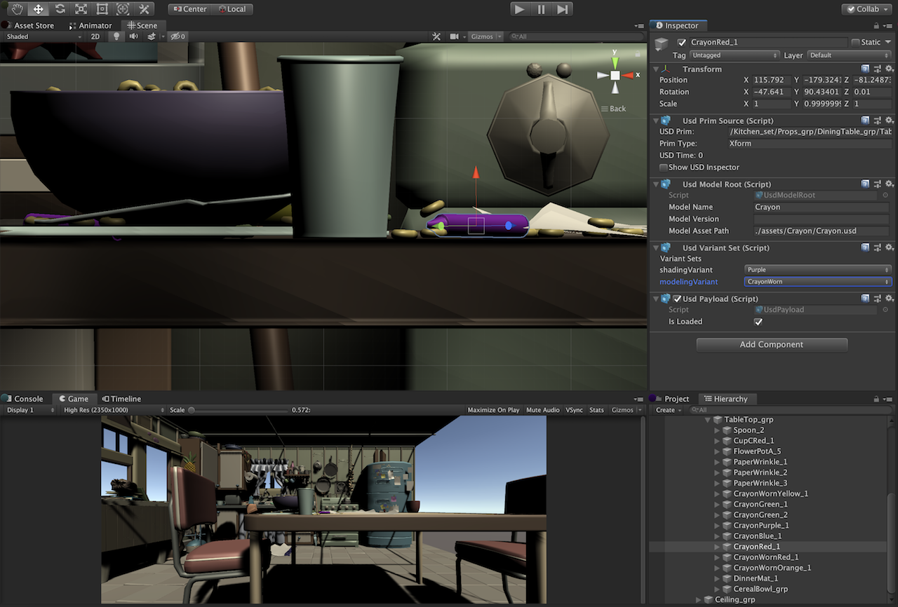

# USD Unity SDK: USD C# Bindings for Unity

This repository contains a set of libraries designed to support the use of
USD in C#/Unity. The goal of this package is to make it maximally easy to
integrate and explore Universal Scene Description.

# Getting Started

To get started, install USD via the Unity Package manager, either by using
an official repository, or by browsing for a local package while working with
source.

Once the USD package is installed, a USD menu will appear, enabling you to
easily import and export USD files.

The USD importer works with linear color space only. To ensure colors are imported correctly,
set the project color space to "linear" in Edit > Project Settings > Player:

In Unity 2019, the USD importer supports importing unlimited weights per vertex. However,
to see the effect of more than 4 weights per vertex, this must be enabled in the project
settings under Edit > Project Settings > Quality:

## Requirements

* Windows / OSX
* Unity version: 2018.3 (2018.3.4f1 and up) and 2019.1 (2019.1.0b2 and up)   
See ["2017 users" section](#unity-2017-users) if you want to use the plugin in Unity 2017.4
* To build a standalone, Api Compatibility Level needs to be set to .NET 4.x   
   In Edit > Project Settings > Player :   
    

## Limitations

* Versions of USD **prior to 19.05** do not handle Alembic playback correctly, resulting significantly slower frame rate than authored in the Alembic cache (24x exactly). This will be fixed with the adoption of the USD 19.05 release and all assets will play back correctly, a priori.

## Samples

The USD package also includes samples to help you get started.
Please note, the way to get them varies depending on the Unity version you are using. See below.

### Unity 2019.1 and Later

Use Package Manager to import the samples into your Assets folder :

### Previous versions

Samples package can be downloaded from [Unity film-tv-toolbox repository](https://github.com/Unity-Technologies/film-tv-toolbox/tree/master/UsdSamples).

# Features

The following is a brief listing of currently supported features:

 * Import as GameObject, Prefab, or Timeline Clip
 * USDZ Export
 * Transform Override Export
 * Timeline Playback (Vertex Streaming & Skeletal Animation)
 * Timeline Recording Track
 * Mesh Import & Export
 * Material Import & Export (USD Preview Surface or DisplayColor)
 * Unity Materials: HDRP, Standard and limited LWRP support
 * Material Export Plugins
 * Variant Selection
 * Payload Load/Unload
 * Automatic Lightmap UV Unwrapping
 * Skeletal Animation via UsdSkel
 * Scene Instancing
 * Point Instancing
 * Integration with C# Job System
 * High and Low Level Access to USD API via C#

## Importing Materials

To import materials from USD, import the USD file using the USD menu. Next, click
on the root GameObject and select either DisplayColor or Preview Surface from the
materials dropdown menu.

## Streaming Playback via Timeline

After importing a USD file with either skeletal or point cache animation, open
the Timeline window. Select the root of the USD file.

Create a playable director by clicking the "Create" button in the Timeline window.
Next, drag the root USD file into the Timeline to create a track for this object.
Finally, drag the USD file once more to add a USD clip to the track for plaback.
Scrubbing through time will now update the USD scene by streaming dat from USD.

Timeline playback is multi-threaded using the C# Job System.

## Variants, Models, & Payloads

Access to variant selection, model details, and payload state are all accessible via
the inspector on the game object at which these features were authored.

