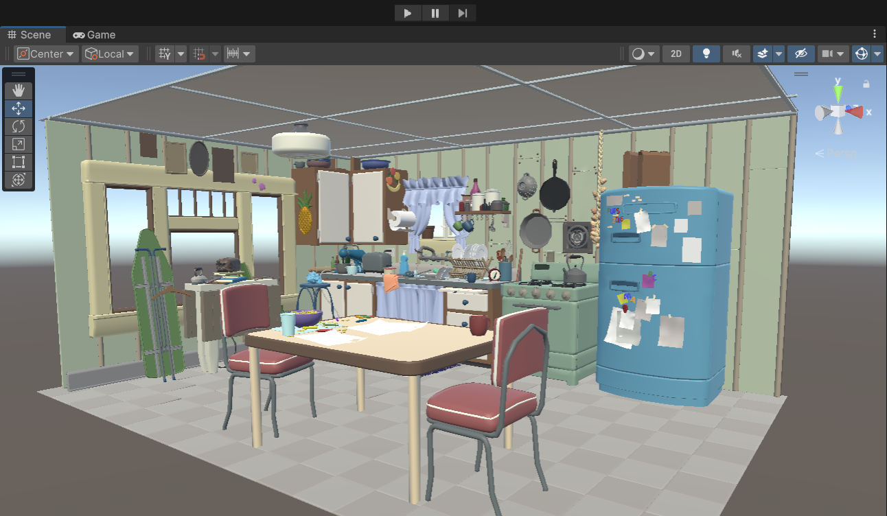
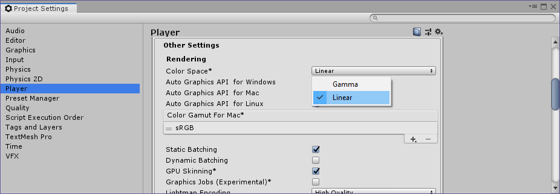
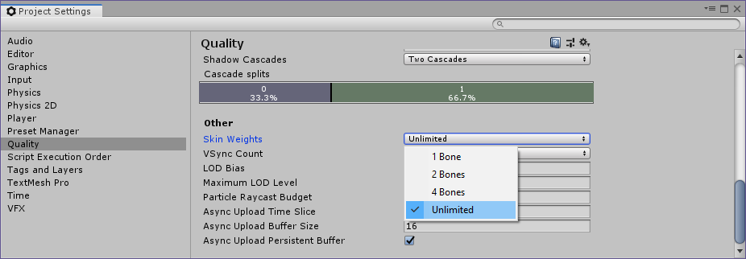

# USD Experimental Package for Unity

This package includes a set of libraries designed to support the use of USD in C#, as well as code to import and export USD files into the editor. The goal of this package is to make it maximally easy to integrate and explore Universal Scene Description.

*Animal Logic's [ALab USD Sample](https://animallogic.com/alab/) in the Unity Editor.*

# Getting Started

## Requirements

* Windows / OSX (*Intel only*)
    * Apple Silicon architectures are not currently supported by this package. To use this package on M1 and M2 devices, you must use an x64 install of the Unity Editor.
* Unity version: 2019.4 and up

## Project Configuration

* The USD importer works with linear color space only. To ensure colors are imported correctly, ensure that the project color space is set to "linear" in Edit > Project Settings > Player:

* This package supports importing USD skinned meshes with unlimited bone weights per vertex. However, to see the effect of more than 4 weights per vertex, Unlimited Skin Weights must be enabled for Unity in the project settings under Edit > Project Settings > Quality:

## Installing the Package

To get started, install the USD package via the Unity Package Manager. You can do this by either:

* installing by name, "com.unity.formats.usd";

* installing by Git URL, "https://github.com/Unity-Technologies/usd-unity-sdk.git?path=package/com.unity.formats.usd";

* or browsing for a local package while working with source.

Once the USD package is installed, a USD menu will appear, enabling you to easily import and export USD files.

## Package Limitations

* The USD plugin bundles are not currently code signed, so will need to be manually signed. 
    * In some cases on MacOS devices, this may mean manually removing the 'com.apple.quarantine' meta flag from the UsdCs.bundle plugin, eg: run `xattr -d com.apple.quarantine <path to package code>/Runtime/Plugins/x86_64/MacOS/UsdCs.bundle`.

* The USD Plugin in this package has not been built against Apple Silicon chips, so running in Silicon native editors is not supported.

* This package uses USD v20.08, so some of the functionality of newer USD versions may be missing.

* Due to conflicting USD plugins, this package may have unexpected errors when installed side-by-side with NVidia's Omniverse Connector package.

## Samples

The USD package also includes samples to help you get started. Use the Package Manager Window to import the samples into your Assets folder. For each of the samples, open the scene file and inspect the relevant Game Object in the Inspector Window to get started.

Note that Samples will not work as expected when installed from Source. For a local package, you can open them directly from the project browser, in the Packages folder. If you are using a Git URL to install the package, the package will be in a readonly state and the Scene will not open. In this case, you will have to copy the Samples files into the project folder to use them.

## Documentation on Package Usage

1. [USD Import](USD%20Import.md)
2. [USD Export](USD%20Export.md)
3. [USD in the Unity Editor](USD-in-the-Editor.md)

## Features

The following is a brief listing of currently supported features:

* Importing and exporting USD:
    * Import as GameObject, Prefab, or Timeline Clip
        * File formats: .usd, .usda, .usdc, .usdz
    * Export Game Objects to USD
        * File formats: .usd, .usda, .usdc, .usdz
        * Export of Transform Overrides
    * Export via Recorder package
* Composition:
    * Variant Selection
    * Payloads
        * Load All and Individual
    * Layer stacks
* Geometry:
    * UV Set
    * Vertex Colour
* Instancing:
    * Point Instancing
    * Scene Instancing
* Primitive Types:
    * Meshes:
        * Arbitrary Primvars
        * Vertex Colors
    * Materials:
        * Standard Shader and Limited HDRP and URP Support
* Cameras
* Lightmaps:
    * Automatic Lightmap UV Unwrapping
* Animation:
    * Timeline Playback:
        * Skeletal Animation via USDSkel
        * Animated Meshes
    * Timeline Recording Track via Unity Recorder Package
* General:
    * High and Low Level Access to USD API via C#

## Known Limitations

We do not currently support the following:

* Geometry:
    * Multiple UV Sets
    * Importing mesh UVs for a prim without a material attached
* Composition:
    * Purposes
* Primitive Types:
    * Camera
        * We do not currently import and export all physical camera settings
    * Materials:
        * Some settings are not correctly imported and must be fixed up manually, eg Rendering mode and Double-Sided
        * Texture scale is not imported to the material's base color
    * Lights
* Animation:
    * Blend Shapes
* General:
    * Custom prims

## Analytics

We collect high level analytics of the features used in the package, to help us understand adoption and prioritize future development work. You can see exactly what data points are collected in `Common\UsdEditorAnalytics.cs`.
